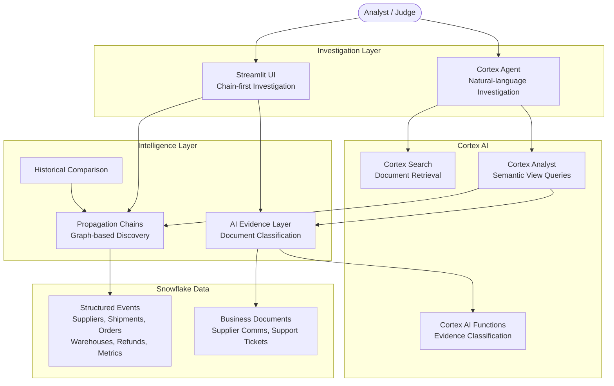

# PROPAGATE

### From the First Signal to the Business Impact

**PROPAGATE** is an AI-native enterprise intelligence system built on Snowflake that reconstructs how an early operational signal propagates across business functions and eventually becomes measurable business impact. It connects structured operational events with unstructured business documents to produce evidence-backed propagation chains — and then lets investigators explore the result through a Cortex Agent.

PROPAGATE does not claim to prove causality. It identifies evidence-backed propagation relationships, surfaces both supporting and contradictory evidence, and reports where the available evidence is incomplete.

**Why this matters.** When revenue declines, the originating signal is often weeks old and buried across operational systems that nobody is looking at together. A supplier disruption becomes a shipment delay, which becomes a warehouse backlog, which becomes late deliveries, complaints, refunds, and finally a revenue decline. Today, connecting these signals is a manual investigation. PROPAGATE automates that investigation and attaches evidence to the path.

---

## The Problem

Business signals are fragmented across operational systems: supplier communications, shipment records, warehouse metrics, order fulfillment, customer support tickets, refund records, and revenue dashboards. Each system detects its own anomalies in isolation.

The visible business impact often appears much later than the originating signal:

```
Supplier disruption
       ↓
Shipment delays
       ↓
Warehouse backlog
       ↓
Late deliveries
       ↓
Customer complaints
       ↓
Refunds
       ↓
Revenue impact
```

The challenge is not detecting a single anomaly. The challenge is answering:

> *"What started this, how did it propagate across business functions, what evidence connects the events, and where could we potentially have detected it earlier?"*

Conventional dashboards show what changed. They do not reconstruct how a signal propagated through multiple business functions over time, or attach evidence to each step.

---

## The Propagation Chain

PROPAGATE's core abstraction is the **propagation chain** — a sequence of evidence-backed relationships connecting an early signal to a downstream business impact.

Each relationship in the chain contains:

- **Temporal evidence** — event ordering and time gaps
- **Entity/structural evidence** — shared suppliers, warehouses, orders, customers
- **Document evidence** — supporting or contradicting text from supplier communications and support tickets
- **Evidence classification** — SUPPORTS, CONTRADICTS, CONTEXT, or missing
- **Uncertainty** — evidence gaps and weak links are explicitly reported

The system separates three distinct layers:

**Structured propagation engine.** A transparent, SQL-based analytical layer identifies candidate relationships from operational events, scores them across five evidence components, and reconstructs chains through graph-based forward-walk discovery. The LLM is not asked to invent the chain.

**AI evidence layer.** Cortex AI functions classify whether business documents support, contradict, or are merely contextual for each inferred relationship. Contradictions are surfaced rather than hidden.

**Investigation layer.** A Cortex Agent lets analysts explore the resulting propagation intelligence using natural language, grounded in the structured chain data and document evidence.

---

## What Makes PROPAGATE Different

| Traditional approach | PROPAGATE |
|---------------------|-----------|
| Detects isolated anomalies | Reconstructs multi-step propagation across business functions |
| Focuses on individual systems | Connects events across supplier, shipping, warehouse, fulfillment, support, and finance |
| Structured data only | Structured events + unstructured document evidence |
| Dashboard-centric | Investigation-centric — the chain is the product |
| Finds "what changed" | Investigates "how it propagated" |
| Generic AI chatbot | Cortex Agent grounded in explicit propagation intelligence |
| Hides uncertainty | Surfaces evidence gaps, weak links, and contradictions |

**The propagation chain is the primary product object — not the chatbot.** The Cortex Agent is the investigation interface over the intelligence that already exists.

---

## Working Prototype

The prototype demonstrates propagation analysis in the **supply-chain domain**:

**Supplier → Shipment → Warehouse → Order/Delivery → Customer Support → Refund → Revenue**

The prototype dataset includes 4 suppliers, 3 warehouses, 8 customers, 10 shipments, 13 orders, 10 refunds, 6 supplier communications, 12 support tickets, and daily business metrics across 3 regions. All seed data is deterministic and reproducible.

The propagation engine processes 783 normalized events, generates 156 candidate relationships, retains 143 through evidence-based scoring, and reconstructs 12 chains (4 complete, 8 partial).

---

## The Demonstrated Scenario

### West Region Revenue Decline — September 2026

```
Sep 01    Supplier schedule disruption (SUP-ACME)           SUPPLIER
              ↓  2 days
Sep 03    Shipment delay (SH-G1)                            SHIPPING
              ↓  2 days
Sep 05    Warehouse backlog (WH-WEST)                       WAREHOUSE
              ↓  11 days
Sep 16    Late delivery (OR-G4)                             FULFILLMENT
              ↓  same day
Sep 16    Customer complaint (ST-G4)                        SUPPORT
              ↓  3 days
Sep 19    Refund issued (RF-G4)                             FINANCE
              ↓  1 day
Sep 20    Revenue impact (west region)                      FINANCE
```

**Prototype results:**

| Metric | Value |
|--------|-------|
| Earliest meaningful signal | Sep 01, 2026 — supplier schedule disruption |
| Observed business impact | Sep 20, 2026 — west-region revenue decline |
| Earliest detection opportunity | **19 days** before business impact |
| Propagation steps | 6 |
| Evidence coverage | 6/6 edges have document evidence |
| Contradictions | 0 in this chain |
| Business impact | West daily revenue fell from ~$125,600 to ~$86,200 |
| Historical recurrence | Same pattern observed in June (13-day lead) and July (14-day lead) |

The root relationship is classified `CAUSAL_STATED` — the supplier communication explicitly states: *"Due to a port closure we are moving your delivery window for WH-WEST back by approximately 10 days."*

---

## Evidence at Every Step

Each propagation relationship carries attached evidence that users can inspect:

**Structural evidence** — temporal precedence, shared entities, historical recurrence, metric deviation, and a composite score from five decomposable components.

**Document evidence** — classified by Cortex AI into:

| Classification | Meaning |
|---------------|---------|
| **SUPPORTS** | Document evidence is consistent with the proposed relationship |
| **CONTRADICTS** | Document evidence weakens or conflicts with the relationship |
| **CONTEXT** | Document is relevant but does not establish support or contradiction |
| **No document evidence** | No matching document was found — the relationship relies on structured data only |

**Contradictions are deliberately surfaced.** For example, when a supplier communication states *"your WH-EAST shipment is on schedule"* but the structured data suggests a delay, the system records and displays the contradiction rather than hiding it.

Across the prototype's chain edges: 26 supporting document matches, 4 contradicting matches, and 10 contextual matches from 13 unique documents.

---

## Earlier Detection

PROPAGATE identifies the earliest meaningful signal in each chain and reports the elapsed time before the downstream business impact.

For the September 2026 scenario, the supplier's port-closure notice was available **19 days** before the revenue impact appeared. The same pattern recurred in June 2026 (13-day lead) and July 2026 (14-day lead).

> This represents a potential detection opportunity, not a guarantee that the downstream impact would have been prevented. Identifying an earlier signal does not establish that acting on it would have changed the outcome.

---

## Historical Pattern Analysis

PROPAGATE compares propagation chains across episodes to identify recurring patterns. Three complete chains share the same 6-step supplier-to-revenue structure in the west region, with different root causes each time:

- **September 2026** — port closure (19-day lead, coherence 0.78)
- **July 2026** — equipment failure at origin (14-day lead, coherence 0.77)
- **June 2026** — customs hold (13-day lead, coherence 0.76)

The recurrence suggests a structural vulnerability in the supply chain, but PROPAGATE treats historical similarity as supporting context — not proof that the same cause applies to each instance.

---

## Cortex Investigation Agent

The Cortex Agent is an **investigation layer** over the existing propagation intelligence. It does not independently discover or invent propagation chains.

**Example questions:**

- *"Why did West-region revenue decline in September 2026?"*
- *"What started the problem?"*
- *"What evidence supports the shipment-delay to warehouse-backlog relationship?"*
- *"Was there contradictory evidence?"*
- *"Could we have detected this earlier?"*
- *"Have we seen something similar before?"*
- *"Which part of the chain has the weakest evidence?"*
- *"What evidence is missing?"*

**Anti-hallucination.** When asked *"Why did East region revenue decline because of SUP-ACME?"*, the Agent responds that no evidence-backed propagation chain supports that relationship — SUP-ACME appears only in west-region chains. It does not manufacture a connection.

The Agent preserves uncertainty, distinguishes evidence from interpretation, and reports evidence gaps alongside its findings.

---

## Architecture



---

## Snowflake + CoCo Technology

| Technology | Role in PROPAGATE |
|-----------|------------------|
| **Snowflake** | All data storage, compute, and analytical processing. Structured events, documents, propagation relationships, evidence, and business metrics live in Snowflake. |
| **Cortex Agent** | Natural-language investigation interface over propagation intelligence. Uses Cortex Analyst for text-to-SQL and Cortex Search for document retrieval. |
| **Cortex Analyst + Semantic View** | Structured semantic model (4 tables, 9 verified queries) enabling the Agent to query chains, evidence, metrics, and historical data accurately. |
| **Cortex Search** | Hybrid vector + keyword search over the unified document corpus (18 documents, `snowflake-arctic-embed-m-v1.5`). |
| **Cortex AI Functions** | `AI_COMPLETE` (evidence classification), `AI_CLASSIFY` (textual evidence scoring), `SENTIMENT` (document sentiment analysis). |
| **Streamlit-in-Snowflake** | Interactive investigation UI — chain visualization, evidence drill-down, historical comparison, and Agent integration. |
| **CoCo CLI** | Development environment used to build, iterate, test, and deploy the entire project within Snowflake. |

---

## Technical Pipeline

```
Raw structured + unstructured data (CORE + DOCS schemas)
              ↓
       Event normalization (EVENT_LOG — 783 events with z-score deviations)
              ↓
     Candidate relationships (156 edges via domain transition graph)
              ↓
     5-component evidence scoring (temporal, structural, magnitude, textual, historical)
              ↓
     Retention threshold (≥ 0.40 → 143 retained edges)
              ↓
     Graph-based forward-walk chain reconstruction (12 chains)
              ↓
     AI document evidence layer (40 evidence records via Cortex AI_COMPLETE)
              ↓
     Contradiction detection + evidence gap identification
              ↓
     Historical comparison across episodes
              ↓
     Cortex Agent + Streamlit investigation
```

Chain discovery is performed through a transparent analytical layer **before** the Agent sees the data. The Agent investigates results; it does not generate them.

---

## Reliability and Guardrails

- **Ground-truth isolation.** Evaluation tables (`GROUND_TRUTH_EDGES`, `CHALLENGE_GROUND_TRUTH_EDGES`) are never queried by the Streamlit UI, Cortex Agent, or semantic view. Confirmed by automated grep audit.
- **Structured inference before LLM.** The propagation engine runs entirely in SQL. The LLM enriches relationships with document evidence but does not discover the chain structure.
- **Evidence attached to individual links.** Each edge carries its own structural score, evidence class, and document evidence status. No chain-level summary hides per-edge weakness.
- **Contradiction surfacing.** 4 contradicting document matches are explicitly displayed, not suppressed.
- **Missing-evidence reporting.** Edges without document evidence show "No document evidence found" rather than generating an explanation.
- **Adversarial testing.** 12 adversarial tests passed in Phase 6, including unrelated-anomaly, temporal-correlation, missing-intermediate, contradiction, generalization, weak-evidence, and anti-hallucination scenarios.
- **Causality discipline.** Every edge carries an evidence class: `CAUSAL_STATED` (document states the cause), `TEXT_SUPPORTED` (document supports), `HISTORICAL_SUPPORTED` (pattern recurs), or `TEMPORAL_STRUCTURAL` (timing only — causation not established).

---

## Evaluation

### Methodology

Evaluation uses deterministic synthetic data with injected ground truth across 3 episodes (September, June, July 2026) plus distractors. A 4th challenge episode (August 2026) tests generalization with previously unseen entities.

Ground truth is **evaluation-only** — never read by the inference engine or production UI.

### Original episodes

| Metric | Value |
|--------|-------|
| Chains reconstructed | 3 (all expected) |
| Earliest-signal detection | 3/3 |
| Evidence coverage | 100% of chain edges have ≥2 evidence components |
| False-link rate | 0.7% (1 of 143 retained edges) |

These metrics apply to a controlled synthetic evaluation with co-designed ground truth and distractors. They do not represent production-scale performance claims.

### Generalization challenge (August 2026, unseen entities)

| Edge | Result | Score |
|------|--------|:-----:|
| Schedule change → Shipment delay | Detected | 0.58 |
| Shipment delay → Warehouse backlog | **Missed** (cold-start) | 0.28 |
| Warehouse backlog → Late delivery | **Missed** (cold-start) | 0.37 |
| Late delivery → Complaint | Detected | 0.59 |
| Complaint → Refund | Detected | 0.57 |
| Refund → Revenue impact | **Missed** (cold-start) | 0.33 |

3 of 6 edges fell below the retention threshold due to zero historical and textual evidence for novel entities. The AI evidence layer found strong supporting documents for 2 of those 3 missed edges, but the evidence enrichment currently runs after edge retention.

---

## Known Limitations

- **Configured transition graph.** The propagation engine uses 6 predefined transition types. Novel propagation paths outside this graph cannot be discovered.
- **Cold-start on novel entities.** Entities appearing for the first time lack historical recurrence evidence, which can cause legitimate relationships to score below the retention threshold.
- **Document retrieval requires entity overlap.** Documents are matched to edges via shared identifiers and temporal proximity. Purely semantic matches without entity overlap are not currently exploited.
- **Single-document corroboration.** Most golden-chain edges are supported by a single document. Independent corroboration is limited.
- **Refund-to-revenue gap.** The refund → revenue impact transition consistently lacks document evidence because revenue impact is an aggregated metric not discussed in individual communications.
- **Agent response latency.** Cortex Agent responses take approximately 15-30 seconds.
- **Single-turn Agent.** Each Agent query is stateless.

---

## Demo Flow (3 minutes)

1. **Open PROPAGATE** — default investigation: West-region September 2026
2. **Read the narrative** — "Supplier schedule disruption → West-region revenue impact"
3. **See the key metric** — 19-day earliest detection opportunity
4. **Walk through the chain** — 6 steps from supplier to revenue, each with evidence badges
5. **Expand a step** — see the supplier quote: *"port closure... delivery window back by approximately 10 days"*
6. **Check Historical Comparison** — same pattern in June and July, revenue chart with dip markers
7. **Ask the Agent** — *"Could we have detected this earlier?"*
8. **Ask the negative test** — *"Why did East region revenue decline because of SUP-ACME?"* — confirm the Agent refuses to invent a chain
9. **Close** — "From the first signal to the business impact"

---

## Repository Structure

```
propagate/
├── README.md
├── .gitignore
├── sql/                            # Phased, idempotent SQL pipeline
│   ├── 01_setup.sql                # Database + schema creation
│   ├── 02_tables.sql               # DDL for all tables
│   ├── 03_seed.sql                 # Deterministic synthetic data
│   ├── 04_event_spine.sql          # Event normalization
│   ├── 05_candidate_linker.sql     # Candidate relationship generation
│   ├── 06_evidence_scorer.sql      # 5-component evidence scoring
│   ├── 07_chain_builder.sql        # Chain reconstruction v1
│   ├── 08_chain_builder_v2.sql     # Chain reconstruction v2 (production)
│   ├── 09_validation.sql           # Evaluation scorecard
│   ├── 10–12_*.sql                 # Challenge episode + evaluation
│   ├── 13_phase3_evidence_layer.sql # AI document evidence
│   ├── 14_phase4_agent.sql         # Agent + semantic view deployment
│   ├── 15_phase5_streamlit.sql     # Streamlit deployment
│   └── phase*_tests.sql            # Per-phase test suites
├── streamlit/
│   ├── streamlit_app.py            # Investigation UI (611 lines)
│   └── snowflake.yml               # Deployment manifest
├── cortex_project/
│   ├── PROPAGATE_ANALYTICS.sv.yaml # Semantic view specification
│   ├── PROPAGATE_AGENT.agent.yaml  # Cortex Agent specification
│   └── cortex-project.yaml         # Deployment manifest
└── docs/                           # Per-phase results and demo script
```

---

## Setup

### Prerequisites

- Snowflake account with Cortex AI functions, Cortex Search, Cortex Agent, and Streamlit enabled
- Warehouse: `COMPUTE_WH` (or substitute your own)
- CoCo CLI or Snowsight SQL worksheet

### Deploy

Run the SQL scripts in order. Each script is idempotent (`CREATE OR REPLACE`).

```sql
-- Foundation + propagation engine
sql/01_setup.sql → 02_tables.sql → 03_seed.sql → 04_event_spine.sql
→ 05_candidate_linker.sql → 06_evidence_scorer.sql → 08_chain_builder_v2.sql
→ 09_validation.sql

-- Challenge episode (optional)
sql/10_phase2_1_challenge.sql → 11_phase2_1_run_engine.sql → 12_phase2_1_evaluation.sql

-- AI evidence layer + Agent + UI
sql/13_phase3_evidence_layer.sql → 14_phase4_agent.sql → 15_phase5_streamlit.sql
```

For Streamlit deployment, replace `<REPO>` in `15_phase5_streamlit.sql` with the absolute path to your local repository clone.

### Access

Open `PROPAGATE.ANALYTICS.PROPAGATE_APP` in Snowsight.

---

## Future Direction

- **Broader domains** — the propagation framework generalizes beyond supply chain to any domain with multi-step operational cascades
- **Richer cold-start handling** — feed document evidence back into scoring to strengthen novel-entity relationships
- **Multi-turn Agent** — threaded investigation sessions for deeper exploration
- **Semantic entity resolution** — match documents to events via meaning, not just identifier overlap
- **Intervention modeling** — quantitative analysis of where earlier action could reduce downstream impact

---

PROPAGATE does not simply answer "what changed?" It reconstructs the path between the first meaningful signal and the eventual business impact, attaches evidence to every step, surfaces contradictions and gaps, and gives investigators a way to examine where earlier detection may have been possible.

**From the first signal to the business impact.**
