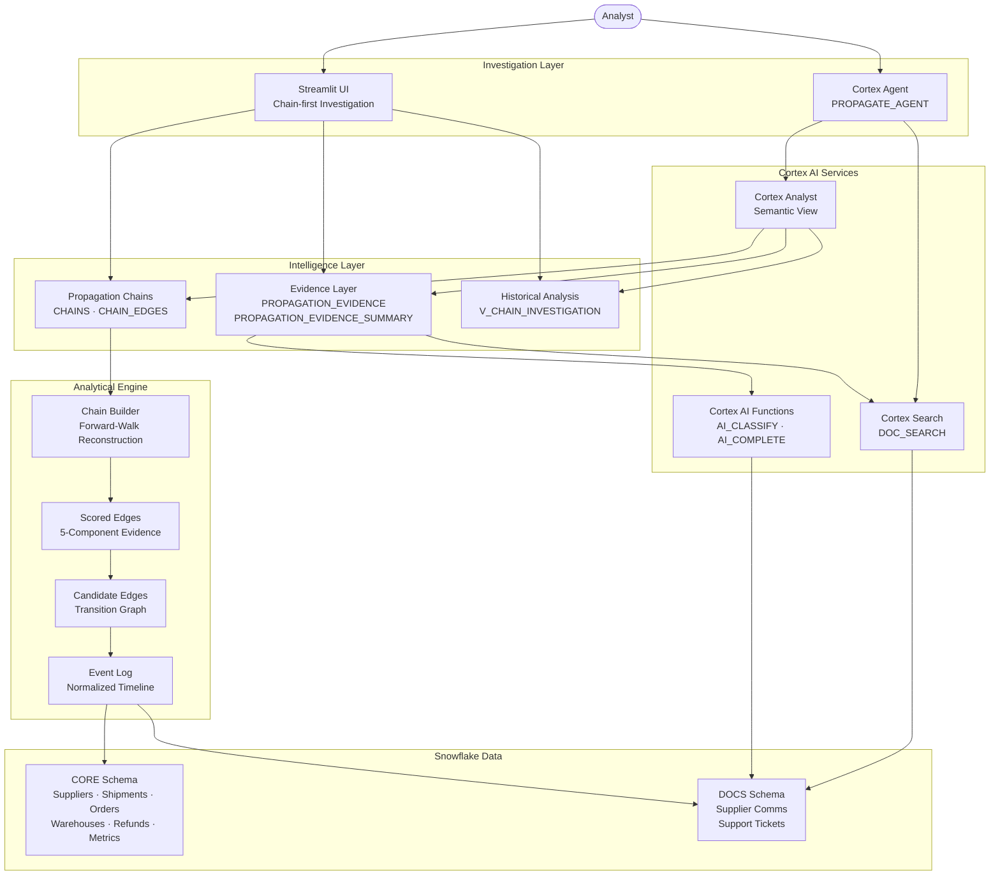
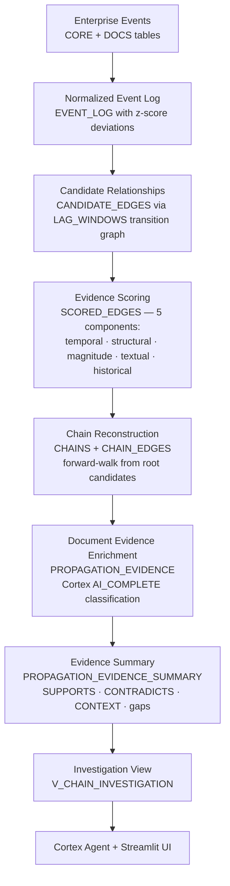

# PROPAGATE

**From the First Signal to the Business Impact**

PROPAGATE is an AI-native enterprise investigation system that reconstructs how an early operational signal propagates across business functions and eventually appears as measurable business impact. It combines structured event relationships, unstructured document evidence, historical comparisons, and a Cortex Investigation Agent to produce evidence-backed propagation chains.

PROPAGATE presents evidence-backed propagation hypotheses — it does not claim to have mathematically proven causality.

---

## Problem

Organizations often see business impact after the underlying operational problem has already propagated across multiple systems. A supplier disruption becomes a shipment delay, which becomes a warehouse backlog, which becomes late deliveries, which become customer complaints and refunds, which finally appear as a revenue decline.

Traditional monitoring detects individual anomalies, but the investigator still has to manually connect these signals across systems, business functions, and time. By the time the revenue impact is visible, the root operational signal may be weeks old.

PROPAGATE addresses this investigation gap by automatically reconstructing the propagation path, attaching evidence to each link, and exposing the result through a structured investigation interface.

---

## What PROPAGATE Does

**Detect → Connect → Evidence → Investigate → Compare → Intervene Earlier**

1. **Reconstructs propagation chains** across heterogeneous business events using a normalized event timeline
2. **Connects events** using temporal precedence, shared entities, and a domain-aware transition graph
3. **Scores relationships** with five decomposable evidence components (temporal, structural, magnitude, textual, historical)
4. **Enriches relationships** with unstructured document evidence via Cortex AI classification
5. **Surfaces contradictory evidence** rather than hiding it — mixed or conflicting signals are explicitly reported
6. **Identifies the earliest meaningful signal** and highlights a potential intervention opportunity
7. **Compares chains** with historical episodes to identify recurring propagation patterns
8. **Exposes the investigation** through a Streamlit UI (chain-first) and a Cortex Agent (natural-language)

> PROPAGATE presents evidence-backed propagation hypotheses; it does not claim that the system has mathematically proven causality. Each link carries an explicit evidence class ranging from `CAUSAL_STATED` (a document explicitly states the cause) down to `TEMPORAL_STRUCTURAL` (timing and entity overlap only — causation not established).

---

## Example Investigation

### West Region Revenue Decline — September 2026

```
Sep 01  Supplier schedule disruption (SUP-ACME)        SUPPLIER
           ↓  2 days
Sep 03  Shipment delay (SH-G1)                         SHIPPING
           ↓  2 days
Sep 05  Warehouse backlog (WH-WEST)                    WAREHOUSE
           ↓  11 days
Sep 16  Late delivery (OR-G4)                          FULFILLMENT
           ↓  same day
Sep 16  Customer complaint (ST-G4)                     SUPPORT
           ↓  3 days
Sep 19  Refund issued (RF-G4)                          FINANCE
           ↓  1 day
Sep 20  Revenue impact (west region)                   FINANCE
```

| Metric | Value |
|--------|-------|
| Earliest signal | Sep 01, 2026 — supplier schedule disruption |
| Business impact | Sep 20, 2026 — west-region revenue decline |
| Signal → Impact | 19 calendar days |
| Chain length | 6 propagation steps |
| Evidence coverage | 6/6 edges have document evidence |
| Contradictions | 0 (in this chain) |
| Chain coherence | 0.78 |
| Potential intervention | Sep 01 at the SUPPLIER function (19-day lead) |

The root edge is classified `CAUSAL_STATED` — the supplier communication explicitly states: *"Due to a port closure we are moving your delivery window for WH-WEST back by approximately 10 days."*

The potential intervention point does not establish that intervening there would have prevented the downstream revenue impact.

---

## Why This Is Different

| Approach | Primary focus | What PROPAGATE adds |
|----------|--------------|-------------------|
| Monitoring / alerting | Individual anomalies | Connects signals across business functions into a chain |
| RAG / document copilot | Answering questions from documents | Links documents to structured event propagation as evidence |
| Process mining | Process execution paths | Connects operational events to downstream business impact |
| Root-cause analysis | Explaining a specific failure | Reconstructs multi-stage propagation with scored evidence |
| Generic enterprise chatbot | Conversational answers | Investigation grounded in explicit propagation chains |

**The propagation chain is the primary product object — not the chatbot.** The Cortex Agent is the investigation interface over the intelligence that already exists.

---

## Architecture



---

## Propagation Analysis Flow



---

## Evidence Model

PROPAGATE distinguishes two types of evidence for each propagation link.

### Structured evidence

Operational event relationships derived from timestamps, shared entity identifiers (supplier, warehouse, order, customer), business metric deviations, and temporal precedence. Scored across five components:

- **Temporal** — how closely the events align within the allowed lag window
- **Structural** — strength of the shared-entity key path
- **Magnitude** — how anomalous both endpoints are (z-score deviation)
- **Textual** — whether a document supports the relationship (via Cortex AI_CLASSIFY)
- **Historical** — whether this relationship recurs in prior periods

### Document evidence

Supplier communications and customer-support tickets are matched to propagation edges by entity overlap and temporal proximity, then classified by Cortex AI_COMPLETE:

| Classification | Meaning |
|---------------|---------|
| **SUPPORTS** | Document provides evidence consistent with the proposed relationship |
| **CONTRADICTS** | Document provides evidence that weakens or contradicts the relationship |
| **CONTEXT** | Document is relevant but does not establish support or contradiction |
| **IRRELEVANT** | Document does not meaningfully relate to the relationship |

### Contradiction detection

Contradictory evidence is deliberately surfaced rather than hidden. For example, if a supplier communication says *"shipment is on schedule"* but the structured data suggests a delay, the system records the contradiction and classifies the edge as `CONTRADICTED` or `MIXED_EVIDENCE`. This is one of the features that differentiates PROPAGATE from simple document retrieval.

### Evidence status per edge

Each propagation edge receives an overall document evidence status: `STRONGLY_SUPPORTED`, `SUPPORTED`, `WEAK_EVIDENCE`, `MIXED_EVIDENCE`, `CONTRADICTED`, or `NO_DOCUMENT_EVIDENCE`.

---

## Data Model

### CORE — Structured Business Data

| Table | Description |
|-------|-------------|
| `SUPPLIERS` | Supplier master data |
| `WAREHOUSES` | Warehouse locations and regions |
| `CUSTOMERS` | Customer records |
| `SHIPMENTS` | Shipment records with schedule and actual dates |
| `ORDERS` | Customer orders with delivery dates |
| `REFUNDS` | Refund records linked to orders |
| `WAREHOUSE_DAILY` | Daily warehouse operational metrics |
| `BUSINESS_METRICS` | Daily regional revenue, repeat purchase rate, support ticket counts |

### DOCS — Unstructured Documents

| Object | Description |
|--------|-------------|
| `SUPPLIER_COMMS` | Supplier communications (6 documents) |
| `SUPPORT_TICKETS` | Customer support tickets (12 documents) |
| `V_ALL_DOCS` | Unified view across both document tables |

### ANALYTICS — Propagation Intelligence

| Object | Type | Description |
|--------|------|-------------|
| `EVENT_LOG` | Table | Normalized event timeline with z-score deviations and entity links |
| `LAG_WINDOWS` | Table | Domain transition graph (6 allowed propagation transitions) |
| `CANDIDATE_EDGES` | Table | All candidate relationships generated by the linker |
| `SCORED_EDGES` | Table | Candidates scored with 5 evidence components |
| `CHAINS` | Table | Reconstructed propagation chain summaries |
| `CHAIN_EDGES` | Table | Step-by-step edges within each chain |
| `PROPAGATION_EVIDENCE` | Table | Per-document, per-edge evidence records (Phase 3) |
| `PROPAGATION_EVIDENCE_SUMMARY` | Table | Per-edge aggregated evidence status |
| `COLD_START_EVIDENCE` | Table | Analysis of Phase 2 cold-start gaps with document evidence |
| `PROPAGATION_LINKS` | View | Scored edges with relationship status and explanation |
| `V_CHAIN_INVESTIGATION` | View | Chain edges joined with evidence summaries for the UI |
| `V_CHAIN_SUMMARY` | View | Chain summary for display |
| `V_CHAIN_DETAIL` | View | Chain detail with event metadata |
| `GROUND_TRUTH_EDGES` | Table | **Evaluation only** — never read by the inference engine or agent |
| `CHALLENGE_GROUND_TRUTH_EDGES` | Table | **Evaluation only** — challenge episode ground truth |
| `VALIDATION_METRICS` | Table | Evaluation scorecard |

### Cortex Services

| Object | Type | Description |
|--------|------|-------------|
| `PROPAGATE_ANALYTICS` | Semantic View | 4-table semantic model (CHAINS, CHAIN_INVESTIGATION, BUSINESS_METRICS, EVENT_LOG) with 9 verified queries |
| `PROPAGATE_AGENT` | Cortex Agent | Investigation agent with Cortex Analyst + Cortex Search tools |
| `DOC_SEARCH` | Cortex Search Service | Hybrid search over the unified document corpus (18 documents) |
| `PROPAGATE_APP` | Streamlit | Chain-first investigation UI |

---

## Snowflake Technologies Used

| Technology | Usage |
|-----------|-------|
| **Snowflake** | All data storage, compute, and orchestration |
| **Cortex Agent** | Natural-language investigation interface (`PROPAGATE_AGENT`) |
| **Cortex Analyst** | Text-to-SQL over the `PROPAGATE_ANALYTICS` semantic view |
| **Cortex Search** | Hybrid vector + keyword search over supplier/support documents (`DOC_SEARCH`, model: `snowflake-arctic-embed-m-v1.5`) |
| **Cortex AI_COMPLETE** | Evidence classification (document → SUPPORTS/CONTRADICTS/CONTEXT) via `llama3.1-70b` |
| **Cortex AI_CLASSIFY** | Textual evidence component in the propagation scorer |
| **Cortex SENTIMENT** | Document sentiment analysis for evidence scoring |
| **Semantic View** | Structured semantic model with verified queries for the Cortex Agent |
| **Streamlit-in-Snowflake** | Chain-first investigation UI deployed as `PROPAGATE_APP` |
| **SQL** | All analytical logic — idempotent, phased pipeline |
| **Python** | Streamlit application (518 lines) |

---

## Trust and Limitations

PROPAGATE is a prototype that demonstrates evidence-backed propagation analysis. The following limitations apply.

**Configured transition graph.** Propagation relationships are constrained to 6 allowed transitions defined in `LAG_WINDOWS`. Novel propagation paths not in this graph cannot be discovered.

**Document retrieval relies on entity overlap.** Documents are matched to edges via shared supplier, warehouse, order, or customer identifiers plus temporal proximity. Documents that discuss a situation without naming specific entities may not be matched.

**Some edges lack document evidence.** The refund → revenue impact transition consistently has no document evidence across all episodes. Revenue impact is an aggregated financial metric not typically discussed in individual supplier communications or support tickets.

**Contradiction detection uses heuristics.** The LLM classifies evidence conservatively. Rule-based overrides are applied for common patterns (e.g., "on schedule" confirmation matched to a delay edge).

**Cold-start limitation.** Novel entities that appear for the first time lack historical recurrence and may not have matching textual evidence. The Phase 2.1 challenge evaluation showed 3/6 edges as false negatives for a previously unseen region/supplier combination, though Phase 3 document evidence could strengthen 2 of those 3 edges.

**Agent latency.** Cortex Agent responses take approximately 15–30 seconds. The UI shows a progress indicator during this wait.

**Agent interaction is single-turn.** Each agent query is stateless. Multi-turn investigation would require thread management.

**Not causal proof.** Evidence-backed propagation analysis identifies temporal, structural, and document-supported relationships. It does not constitute mathematical proof of causality.

---

## Evaluation

### Methodology

Evaluation uses deterministic synthetic data with injected ground truth. Three episodes contain known propagation chains (golden September 2026, historical June and July 2026), plus distractors (on-schedule confirmations, positive tickets, unrelated refunds, promotional blips). A fourth challenge episode (August 2026) uses previously unseen entities (SUP-DELTA, WH-CENTRAL, central region) to test generalization.

Ground truth edges are stored in `GROUND_TRUTH_EDGES` and `CHALLENGE_GROUND_TRUTH_EDGES`. These are **evaluation-only** — never read by the inference engine, agent, or UI at runtime.

### Original episodes (September, June, July)

Evaluated against 18 ground truth edges across 3 known chains:

| Metric | Value | Notes |
|--------|-------|-------|
| Chain reconstruction F1 | 1.0 | All 3 expected chains reconstructed |
| Precision | 1.0 | No false-positive chain edges among retained edges |
| Recall | 1.0 | All ground truth edges retained |
| Earliest signal detection | 3/3 | Each chain rooted at the correct earliest signal |
| Evidence coverage | 100% | Every chain edge has ≥2 non-zero evidence components |
| False-link rate | 0.7% | 1 of 143 retained edges is a known false link |
| Historical replay | 2/2 | June and July chains correctly reconstructed |

These metrics reflect a controlled synthetic evaluation, not production-scale performance. Precision and recall of 1.0 are achievable because the ground truth, distractors, and scoring thresholds were designed together. Real-world performance would depend on data quality, domain coverage, and transition graph completeness.

### Challenge episode (August 2026 — unseen entities)

| Step | Relationship | Result | Score |
|------|-------------|--------|-------|
| 1 | Schedule change → Shipment delay | TRUE_POSITIVE | 0.58 |
| 2 | Shipment delay → Warehouse backlog | FALSE_NEGATIVE | 0.28 |
| 3 | Warehouse backlog → Late delivery | FALSE_NEGATIVE | 0.37 |
| 4 | Late delivery → Complaint | TRUE_POSITIVE | 0.59 |
| 5 | Complaint → Refund | TRUE_POSITIVE | 0.57 |
| 6 | Refund → Revenue impact | FALSE_NEGATIVE | 0.33 |

3 of 6 edges fell below the 0.40 retention threshold due to cold-start: zero textual and zero historical evidence for novel entities. Phase 3 document evidence could strengthen 2 of those 3 (the supplier communication explicitly references the affected warehouse), but Phase 2 must retain an edge before Phase 3 can enrich it.

### Document evidence layer (Phase 3)

| Metric | Value |
|--------|-------|
| Document evidence coverage | 24/29 chain edges (82.8%) |
| Supporting document matches | 26 |
| Contradicting document matches | 4 |
| Context document matches | 10 |
| Unique documents contributing | 13 of 18 (72.2%) |

### Anti-hallucination

When asked *"Why did East region revenue decline because of SUP-ACME?"*, the agent responds that no evidence-backed propagation chain connects SUP-ACME to an East-region revenue decline, and explains that SUP-ACME appears only in west-region chains.

---

## Demo Flow

1. Open PROPAGATE in Snowsight
2. Default investigation: **West — September 2026** (CHAIN_SC-G1)
3. Walk through the 6-step propagation timeline — each step shows structural evidence class and document evidence status
4. Switch to **Evidence Deep-Dive** — select an edge and show the supporting document snippet (*"port closure... delivery window back by approximately 10 days"*)
5. Switch to **Historical Comparison** — show that the same pattern occurred in June and July with 13-day and 14-day lead times
6. Show executive summary cards: 19-day signal-to-impact, 6/6 evidence coverage
7. Switch to **Investigation Agent** and ask:
   - *"What started the problem?"*
   - *"Could we have detected this earlier?"*
   - *"Which part of the chain has the weakest evidence?"*
8. Ask the negative test: *"Why did East region revenue decline because of SUP-ACME?"* — confirm the agent does not invent a relationship

---

## Repository Structure

```
propagate/
├── README.md
├── .gitignore
│
├── sql/                          # Phased, idempotent SQL pipeline
│   ├── 01_setup.sql              # Database and schema creation
│   ├── 02_tables.sql             # DDL for CORE, DOCS, and ANALYTICS tables
│   ├── 03_seed.sql               # Deterministic synthetic data generation
│   ├── 04_event_spine.sql        # Normalized event log with z-score deviations
│   ├── 05_candidate_linker.sql   # Candidate edge generation via transition graph
│   ├── 06_evidence_scorer.sql    # 5-component evidence scoring
│   ├── 07_chain_builder.sql      # Chain reconstruction (v1, backward-walk)
│   ├── 08_chain_builder_v2.sql   # Chain reconstruction (v2, forward-walk + coherence)
│   ├── 08_streamlit_deploy.sql   # Original Streamlit deployment
│   ├── 09_validation.sql         # Evaluation scorecard
│   ├── 10_phase2_1_challenge.sql # Challenge episode injection (unseen entities)
│   ├── 11_phase2_1_run_engine.sql# Re-run engine on expanded dataset
│   ├── 12_phase2_1_evaluation.sql# Challenge evaluation
│   ├── 13_phase3_evidence_layer.sql # AI document evidence layer
│   ├── 14_phase4_agent.sql       # Cortex Agent + semantic view deployment
│   ├── 15_phase5_streamlit.sql   # Updated Streamlit deployment
│   ├── phase1_tests.sql          # Foundation tests (30 checks)
│   ├── phase2_tests.sql          # Event spine tests
│   ├── phase3_tests.sql          # Candidate linker tests
│   ├── phase4_tests.sql          # Evidence scorer tests
│   ├── phase5_tests.sql          # Chain builder tests
│   ├── phase6_tests.sql          # Agent + semantic view tests
│   └── phase8_tests.sql          # Final validation (12 assertions)
│
├── streamlit/
│   ├── streamlit_app.py          # Streamlit-in-Snowflake application (518 lines)
│   └── snowflake.yml             # Deployment manifest
│
├── cortex_project/
│   ├── cortex-project.yaml       # Agent Studio deployment manifest
│   ├── PROPAGATE_ANALYTICS.sv.yaml  # Semantic view specification
│   └── PROPAGATE_AGENT.agent.yaml   # Cortex Agent specification
│
└── docs/
    ├── demo_script.md
    ├── phase0_capability_matrix.md
    ├── phase1_results.md
    ├── phase2_results.md
    ├── phase3_results.md
    ├── phase3_ai_evidence_results.md
    ├── phase4_results.md
    ├── phase5_results.md
    ├── phase6_results.md
    ├── phase7_results.md
    └── phase8_results.md
```

---

## Setup and Deployment

### Prerequisites

- Snowflake account with Cortex AI functions enabled
- Warehouse: `COMPUTE_WH` (or substitute your own)
- Role with CREATE DATABASE, CREATE SCHEMA, CREATE STAGE, CREATE STREAMLIT, CREATE AGENT, CREATE SEMANTIC VIEW privileges
- Cortex Search, Cortex Agent, and Cortex AI functions available in your region

### Deploy

Run the SQL scripts in order. Each script is idempotent.

```sql
-- Foundation
-- Execute in Snowsight or via CoCo CLI:
sql/01_setup.sql
sql/02_tables.sql
sql/03_seed.sql

-- Propagation engine
sql/04_event_spine.sql
sql/05_candidate_linker.sql
sql/06_evidence_scorer.sql
sql/08_chain_builder_v2.sql
sql/09_validation.sql

-- Challenge episode (optional)
sql/10_phase2_1_challenge.sql
sql/11_phase2_1_run_engine.sql
sql/12_phase2_1_evaluation.sql

-- AI evidence layer
sql/13_phase3_evidence_layer.sql

-- Cortex Agent + semantic view
sql/14_phase4_agent.sql

-- Streamlit UI
sql/15_phase5_streamlit.sql
```

### Access

After deployment, open the Streamlit application in Snowsight:

**PROPAGATE.ANALYTICS.PROPAGATE_APP**

The Cortex Agent is also available directly via:

**PROPAGATE.ANALYTICS.PROPAGATE_AGENT**

---

## Causality Discipline

Every propagation edge carries an explicit evidence class:

| Evidence Class | Meaning |
|---------------|---------|
| `CAUSAL_STATED` | A source document explicitly states the causal relationship |
| `TEXT_SUPPORTED` | A document supports the link but does not explicitly state causation |
| `HISTORICAL_SUPPORTED` | This relationship recurs in prior periods, providing pattern-based evidence |
| `TEMPORAL_STRUCTURAL` | Only timing and shared entity overlap — causation is **not** established |
| `CORRELATION_ONLY` | Weakest evidence — causation is **not** established |

Where causal evidence is insufficient, the system says so.

---

PROPAGATE does not simply answer "what happened?" It reconstructs the path between the first meaningful signal and the eventual business impact, shows the evidence connecting each step, and gives investigators a way to examine where earlier intervention may have been possible.
